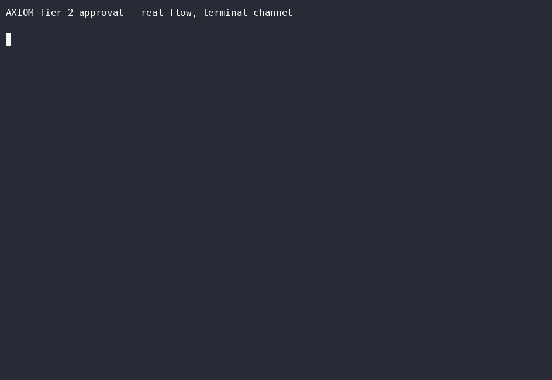

# AXIOM

**Give your AI agents access to real infrastructure — with a fail-closed wall that makes them ask permission before anything dangerous.**



*Real approve/deny cycle - real `Tier2ApprovalFlow`, real tamper-evident audit
log, real `MockDestructiveCapability` built for exactly this kind of
rehearsal (see `axiom-gateway/examples/demo_approve_deny.rs`). The terminal
channel stands in for forge-node's actual Telegram-based approval - a phone
tap doesn't record cleanly to GIF. That real Telegram flow is captured
below, unedited, from an actual production run.*

### Live demo: a real destructive action, denied, in production

Unedited output from an actual run, 2026-08-21 — a throwaway node proposes
creating a WireGuard peer (Tier 2, destructive), a real Telegram prompt goes
to the owner's phone, the owner taps Deny, and the tamper-evident audit log
is the only source of truth for what actually happened next:

```
$ bash axiom-demo-deny.sh
=== AXIOM: real Tier 2 destructive action, denied live ===

3. Sending a real request: create a WireGuard peer named 'axiom-demo-DENY-ME'
   >>> CHECK TELEGRAM NOW - tap DENY on the approval prompt <<<
4. Waiting up to 120s for a real decision (intent aec85b912e9c840596705ee8556b412e)...
   Decision received after 6s.

   Real outcome, from the tamper-evident audit log:
  intent_id:  aec85b912e9c840596705ee8556b412e
  decision:   {'allowed': False, 'reason': 'denied by telegram'}
  entry_hash: 293f8124a6a2dfc10f13adf0...

5. Confirming no peer was actually created:
   Confirmed: no peer named 'axiom-demo-DENY-ME' exists. Denied means denied.
```

A video walkthrough may follow, but this transcript is the actual evidence —
not a recreation of it.

## The problem

AI agents are increasingly wired directly into real infrastructure — servers, home automation, network gear, cloud accounts — with the same access a human operator would have and none of a human's judgment about when to stop and ask. That gap is where things go wrong. AXIOM is the guardrail: every action an agent takes through it is identified, explicitly permissioned, and — for anything destructive — held for a real human to approve before it runs.

## What it does

- **Tiered permissions** — every capability is classified by blast radius (read-only, reversible action, or destructive), not just read/write.
- **Per-workload cryptographic identity** — every caller is a real keypair, not a shared credential or an API key everyone reuses.
- **Human approval on anything destructive** — Tier 2 actions require a real, per-invocation approval (currently via Telegram) before they execute. No standing grants, no "trust this caller forever."
- **Tamper-evident audit log** — every Tier 2 action that executes is hash-chained; a tampered or deleted entry is detectable.
- **Fail-closed by default** — every capability ships with an empty allowlist. Nothing is reachable until it's deliberately turned on for a specific caller.

Full plain-language explanation: **[CONCEPT.md](CONCEPT.md)**. Design/protocol detail: **[ARCHITECTURE.md](ARCHITECTURE.md)**. Ratified decisions and reasoning: **[DECISIONS.md](DECISIONS.md)**.

## Quickstart (verified, ~5 minutes)

Two local nodes, one asks the other to `echo` — the smallest possible real round trip through the whole system: identity, discovery, policy check, signed request, signed reply.

```sh
cargo build --workspace --release

# Two node identities
./target/release/forge-node init --data-dir /tmp/axiom-a/data --output /tmp/axiom-a
./target/release/forge-node init --data-dir /tmp/axiom-b/data --output /tmp/axiom-b

# Give them non-conflicting ports
sed -i 's/0.0.0.0:7777/0.0.0.0:7778/' /tmp/axiom-a/config.toml

# Allow B to call A's echo capability (fail-closed by default — this is the deliberate opt-in step)
B_ID=$(grep node_id /tmp/axiom-b/config.toml | cut -d'"' -f2)
sed -i "s/allowed_peers = \[\]/allowed_peers = [\"$B_ID\"]/" /tmp/axiom-a/capability_policy.toml

# Start A, then ask it for echo from B
./target/release/forge-node --config /tmp/axiom-a/config.toml start &
./target/release/forge-node --config /tmp/axiom-b/config.toml intent --bootstrap 127.0.0.1:7778 --capability echo --payload "hello axiom"
```

Expect: `Fulfill from <A's node id>: hello axiom`.

## Scope

**Shipped and covered by this README**: `forge-node` (the node daemon) and `axiom-gateway` (tiering, policy, approval, audit). The workspace also contains other crates in earlier/experimental states — not part of the shipped system, not covered by any claim here.

## Status

Transport, discovery, and the security/policy layers are built and tested against real infrastructure — including a real Tier 2 approval, proven with an actual human tap, not simulated. Evidence: **[TESTING.md](TESTING.md)** — an adversarial test suite that actively tries to defeat the claims above, not just re-check happy paths.

**Single-owner homelab tool. Use at your own risk.** This is a young, actively-developed personal project, not an audited commercial product. Read **[SECURITY.md](SECURITY.md)**'s "Known limitations" section before relying on it for anything that matters.

## Platform support

- **Linux**: primary target, production-hardened.
- **Windows**: native port, full parity with Linux — live-tested for both passive operation (discoverable, serves capabilities) and actively originating calls (control socket, explicit connect, `bootstrap_nodes` through VPN).

## Building

```
cargo build --workspace --release
cargo test --workspace --release
```

CI runs both on every push/PR.

## Contributing

See [CONTRIBUTING.md](CONTRIBUTING.md) - how to report issues (including security ones), and what a PR needs to get merged.

## License

MIT — see [LICENSE](LICENSE).
